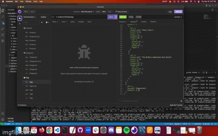
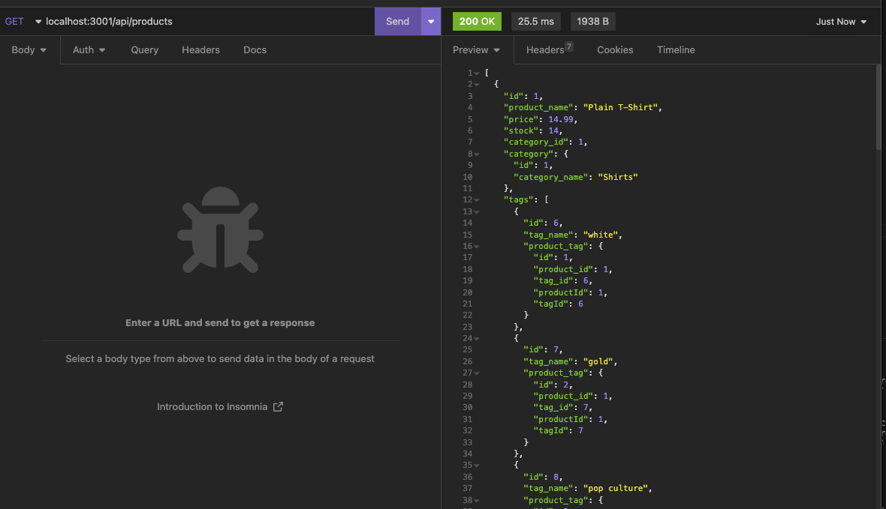

# E-Commerce-Back-End

  ## Description:
  This app will help a manager at an internet retail company manage a back end for their e-commerce website that uses the latest technologies so their company can compete with other e-commerce companies

  ## Table of Contents:
  - [Installation](#installation)
  - [Usage](#usage)
  - [License](#license)
  - [Contributions](#contributions)
  - [Published Page](#page)
  - [Repo](#repo)

 ## Installation
 You will need to make sure you have mySQL on your machine. [See here for install instructions. ](https://dev.mysql.com/doc/refman/8.0/en/installing.html)
 Once MySQL is installed, install all of the dependencies in the package.json file, run MySQL in your terminal and run the schema file in the 'db' folder. 
 Once that is done you should be able to run node on the 'index.js' file inside of the seeds folder and seed your database. Finally you can run node on the 'server.js' file and all of the seeded data will apear correctly in Insomnia

 ## Usage 
   Once you run node on the 'server.js' file, you will be told which port the app is listening on. All of the data seeded into the database will then appear on Insomnia through GET requests. You're also able to make POST, PUT, and DELETE requests to all of the different tables added.

 ## License 
  N/A

 ## Contributions 
  N/A

 ## Screen Shot
 

# LINKS

 ## Link to Google Drive Video 
https://drive.google.com/file/d/1S7IYCO0l9CO4ckx6tCrLKQ91za_E7zsq/view?usp=sharing

 ## Repo 
 https://github.com/Zcordeiro/E-Commerce-Back-End

